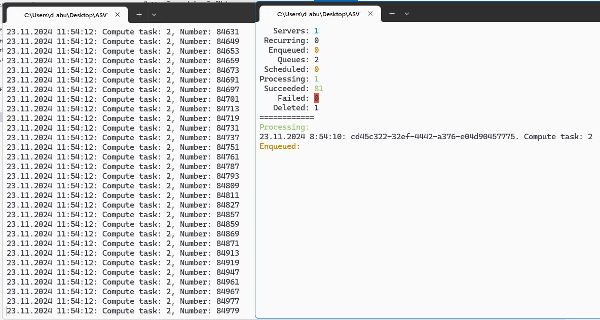

# Управления и мониторинг фоновых задач с использованием Hangfire и Redis

.NET приложение для управления и мониторинга фоновых задач с использованием Hangfire и Redis. Система предоставляет консольный интерфейс для управления задачами с мониторингом статистики в реальном времени.

## Возможности

- Мониторинг задач и статистики в реальном времени
- Хранение задач в Redis
- Интерактивный консольный интерфейс управления
- Поддержка нескольких типов задач:
  - Длительные вычислительные задачи
  - Задачи поиска простых чисел
- Возможность отмены задач
- Отображение статистики в реальном времени

## Требования

- .NET 6.0 или выше
- Redis Server (по умолчанию на localhost:6379)
- Пакет Hangfire.Redis.StackExchange
- Пакет StackExchange.Redis

## Установка

1. Клонируйте репозиторий:
```bash
git clone https://github.com/your-username/ASVT.git
```

2. Установите необходимые NuGet пакеты:
```bash
dotnet restore
```

3. Убедитесь, что Redis запущен на localhost:6379 (или обновите строку подключения в Program.cs)

## Использование

Запустите приложение командой:
```bash
dotnet run
```

### Управляющие клавиши

- `N` - Добавить новую длительную вычислительную задачу
- `P` - Добавить новую задачу поиска простых чисел
- `C` - Отменить определённую задачу (запрашивает ключ задачи)
- `ESC` - Выйти из приложения

### Реализация задач

#### Поиск простых чисел (GregoryLeibnizGetPIJob)

```csharp
public class GregoryLeibnizGetPIJob : IComputePiJob
{
    // Метод проверки числа на простоту
    public bool isSimple(int N)
    {
        for (int i = 2; i < (int)(N / 2); i++)
        {
            if (N % i == 0)
                return false;
        }
        return true;
    }

    // Асинхронный метод вычисления простых чисел
    public Task ComputePyAsync(string name, int iterrations, CancellationToken token)
    {
        for (int i = 2; i <= iterrations; i++)
        {
            if (isSimple(i))
            {
                Console.WriteLine($"{DateTime.Now}: Compute task: {name}, Number: {i}");
            }
        }
        return Task.CompletedTask;
    }
}
```

Задача поиска простых чисел:
- Принимает параметры: имя задачи и количество итераций
- Проверяет числа на простоту методом перебора делителей
- Выводит найденные простые числа в консоль с меткой времени
- Поддерживает отмену выполнения через CancellationToken

### Отображение в консоли

Приложение отображает статистику в реальном времени, включая:
- Количество активных серверов
- Количество периодических задач
- Задачи в очереди
- Количество очередей
- Запланированные задачи
- Задачи в обработке
- Успешно выполненные задачи
- Задачи с ошибками
- Удалённые задачи

## Архитектура

Проект использует:
- Hangfire для обработки фоновых задач
- Redis для хранения задач
- StackExchange.Redis для взаимодействия с Redis
- Пользовательский класс ConsoleHelper для форматированного вывода в консоль

## Структура кода

- `Program.cs` - Точка входа в приложение и логика управления задачами
- Интерфейсы задач:
  - `ILongRunningJob` - Интерфейс для длительных вычислительных задач
  - `IComputePiJob` - Интерфейс для задач поиска простых чисел
- `GregoryLeibnizGetPIJob` - Реализация алгоритма поиска простых чисел
- `ConsoleHelper` - Вспомогательный класс для форматированного вывода в консоль

## Скрины работы:


