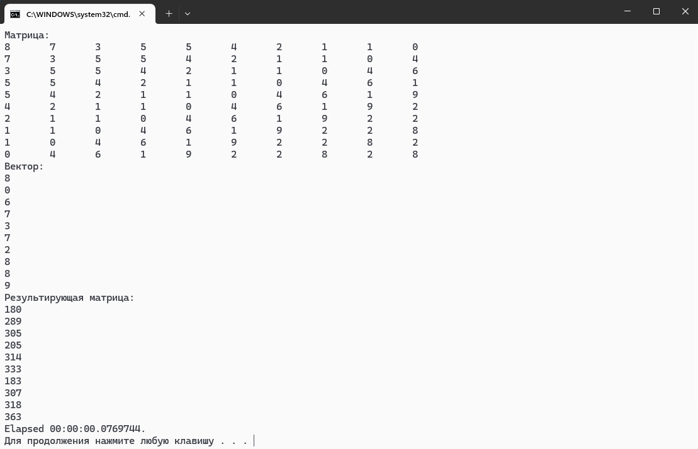

# MPI Matrix Multiplication in C#

Этот проект реализует умножение матрицы на вектор с использованием библиотеки MPI. Программа распределяет вычисления между несколькими процессами, что позволяет эффективно использовать многопоточность и ускорять операции над большими матрицами.

## Описание

Программа выполняет умножение матрицы на вектор:

- **mA** (размером 10x10)
- **vB** (размером 1x10)
- Результат хранится в **vC** (размером 1x10)

Процесс делится на несколько этапов:

1. **Инициализация**: Процесс с рангом 0 (главный процесс) инициализирует матрицу `mA` и вектор `mB`, заполняя их значениями.
2. **Рассылка матрицы и вектора**: Главный процесс отправляет матрицу и вектор всем другим процессам.
3. **Получение данных**: Остальные процессы получают данные.
4. **Вычисление**: Каждый процесс вычисляет часть результирующего вектора `vC`, основываясь на распределенных строках матрицы `mA`.
5. **Рассылка результирующего вектора**: Другие процессы отправляют части результирующего вектора главному процессу.
6. **Сбор результата**: Главный процесс собирает результаты от всех других процессов и выводит окончательный вектор.

## Запуск

Для запуска программы выполните следующие шаги:

1. Скомпилируйте проект:
   ```bash
   dotnet build
   ```

2. Запустите программу с использованием MPI:
   ```bash
   mpiexec -n <number_of_processes> dotnet run
   ```
   Замените `<number_of_processes>` на желаемое количество процессов.

## Код

Вот основные части кода:

- **Инициализация матриц**:
    ```csharp
    for (int i = 0; i < rA; i++)
    {
        for (int j = 0; j < cA; j++)
        {
            mA[i * colsA + j] = countA++; // Заполнение матрицы A
        }
    }
    ```

- **Отправка и получение данных**:
    ```csharp
    communicator.Send(item, i, 0); // Отправка элемента
    mA[i * cA + j] = communicator.Receive<int>(0, 0); // Получение элемента
    ```

- **Вычисление матричного произведения**:
    ```csharp
    for (int i = startRow; i < endRow; i++) // Перемножение определенных за процесом строк
	{
        vC[i] = 0;
        for (int k = 0; k < cA; k++)
        {
            vC[i] += mA[i * cA + k] * vB[k];
        }
	}
    ```

## Примечания

- Для корректной работы необходимо, чтобы количество процессов было делителем количества строк в `mA`.
- Программа использует `Stopwatch` для измерения времени выполнения.
- Программа использует 'Random' для заполнения матрицы и вектора

## Скрины работы:

