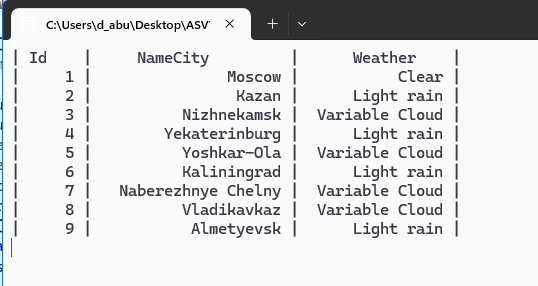
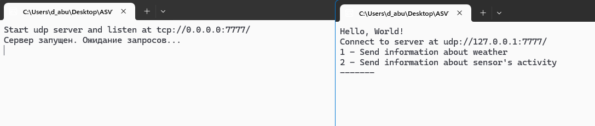
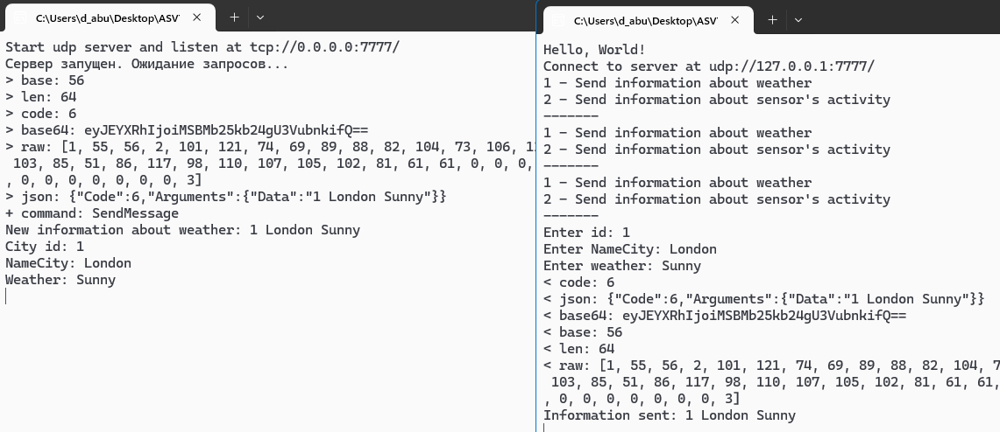
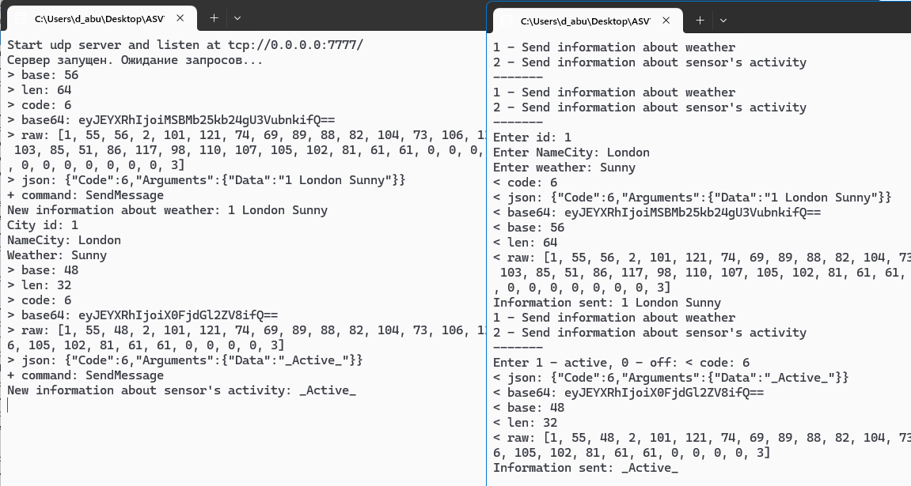

# TCP Приложение для симуляции погоды 🌤️🌧️

**Приложение для симуляции погоды** — это .NET-приложение, демонстрирующее асинхронное взаимодействие клиента и сервера через TCP и симуляцию обновления погодных условий для различных городов.

Проект использует `NetTcpClient` для подключения к серверу, управления данными пользователей и динамического назначения погодных условий.

## Основные возможности 🚀

- **Клиент-серверное взаимодействие**: Устанавливает TCP-соединение для работы с сервером.
- **Управление пользователями**: Получение и обновление информации о пользователях.
- **Симуляция погоды**: Случайное назначение погодных условий для городов.
- **Асинхронные операции**: Использование async/await для выполнения неблокирующих вызовов.
- **Консольный интерфейс**: Отображение обновлений в режиме реального времени.

## Обзор кода 📂

### Главная программа

Точка входа инициализирует TCP-клиент и подключается к серверу по адресу `tcp://127.0.0.1:5555`. Затем вызывается метод `ManageUsers`, который управляет данными пользователей и симулирует погодные условия.

```csharp
public static async Task Main(string[] args)
{
    var serverAdress = new Uri("tcp://127.0.0.1:5555");
    var client = new NetTcpClient(serverAdress);
    Console.WriteLine($"Connect to server at {serverAdress}");
    await client.ConnectAsync();

    var userApi = new UserApiClient(client);
    await ManageUsers(userApi);
    client.Dispose();
}
```

### Логика симуляции погоды

Метод `ManageUsers`:
- Получает список пользователей с сервера.
- Назначает случайные погодные условия из заранее определённого массива.
- Обновляет и отображает статус погоды для пользователя в реальном времени.

```csharp
string[] weatherArray = { "Cloudy", "Clear", "Variable Cloud", "Rain", "Light rain" };
Random random = new Random();

int CityStatus = random.Next(1, 10);
int CityStatus11 = random.Next(1, 7);

var addUser = new User(
    Id: user1.Id,
    Name: user1?.Name,
    Active: weatherArray[CityStatus11]
);
var addResult = await userApi.UpdateAsync(CityStatus, addUser);
```

### Вывод в консоль

В консоли отображается таблица с данными пользователей: идентификатор, название города и погодный статус.

```plaintext
| Id  | NameCity           | Weather          |
| 1   | New York           | Cloudy           |
| 2   | Los Angeles        | Clear            |
```

## Требования 🛠️

- [SDK .NET 6](https://dotnet.microsoft.com/download/dotnet/6.0)
- Работающий TCP-сервер, совместимый с реализацией `NetTcpClient`.

## Скриншоты


---

# UDP Система мониторинга погоды 🌦️

Этот проект представляет собой простое клиентское приложение на основе UDP для отправки и получения сообщений, связанных с данными о погоде и активностью датчиков. Программа подключается к серверу UDP и предоставляет консольный интерфейс для отправки обновлений погоды или переключения состояний датчиков.

---

## Возможности 🚀

- **Отправка данных о погоде**: введите погодные условия и отправьте их на сервер.
- **Переключение активности датчика**: переключайте состояния датчиков между активным и выключенным.
- **Консольный интерфейс**: интерактивный интерфейс на основе меню для удобства использования.
- **Асинхронная передача сообщений**: поддерживает асинхронную связь с сервером.

---

## Использование 📖

После запуска программы вы увидите меню в консоли:

```
1 - Send information about weather
2 - Send information about sensor's activity
-------
```

### Опции
1. **Отправка данных о погоде**:
   - Введите `ID`, `City Name`, и `Weather` когда вас попросят.
   - Привет:
     ```
     Enter id: 101
     Enter NameCity: London
     Enter weather: Sunny
     ```
   - Программа отправляет объединеннуб информацию на сервер.

2. **Переключатель активности датчика**:
   - Введите `1` чтобы активировать датчик или `0` чтобы деактивировать его.
   - Пример:
     ```
     Enter 1 - active, 0 - off: [Press 1 or 0]
     ```


## Обзор кода 💻

- **NetUdpClient**: обрабатывает обмен данными с сервером по протоколу UDP.
- **MessageApiClient**: предоставляет высокоуровневые методы для отправки сообщений через NetUdpClient.
- **ManageMessages**: основная логика обработки пользовательского ввода и взаимодействия с API-клиентом.
- **PrintMenu**: отображает меню безопасным для многопоточности способом.

---

## Пример взаимодействия 📝

```
Hello, World!
Connect to server at udp://127.0.0.1:7777
1 - Send information about weather
2 - Send information about sensor's activity
-------
Enter id: 202
Enter NameCity: New York
Enter weather: Rainy
Information sent: 202 New York Rainy
```

---


## Скриншоты


